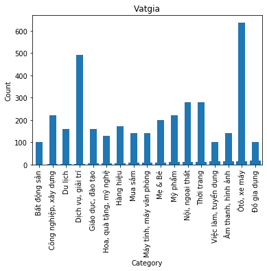

# Visualization Vatgia

## Trực quan hoá dữ liệu lấy từ trang web vatgia.com
### Dữ liệu bao gồm các trường:
- Loại sản phẩm
- Giá của sản phẩm
- Những lời bình luận
- Tiêu đề


```python
from matplotlib import pyplot as plt
```


```python
import pandas as pd
columns = ['title','price','category','comments']

vatgia = pd.read_json('vatgia.json',columns)
```

### Đọc dữ liệu từ file "vatgia.json"
### Dữ liệu gồm 3666 sản phẩm


```python
vatgia
```


<div>
<style scoped>
    .dataframe tbody tr th:only-of-type {
        vertical-align: middle;
    }

    .dataframe tbody tr th {
        vertical-align: top;
    }

    .dataframe thead th {
        text-align: right;
    }
</style>
<table border="1" class="dataframe">
  <thead>
    <tr style="text-align: right;">
      <th></th>
      <th>category</th>
      <th>price</th>
      <th>comments</th>
      <th>title</th>
    </tr>
  </thead>
  <tbody>
    <tr>
      <td>0</td>
      <td>Ôtô, xe máy</td>
      <td>3,3 triệu</td>
      <td>None</td>
      <td>Beeshop.vn Giao Xe Đạp Gấp Oyama Sg-04, Tận Nh...</td>
    </tr>
    <tr>
      <td>1</td>
      <td>Nội, ngoại thất</td>
      <td>Liên hệ</td>
      <td>None</td>
      <td>Đèn Diệt Côn Trùng We-150-2S (Ds-D152I)</td>
    </tr>
    <tr>
      <td>2</td>
      <td>Ôtô, xe máy</td>
      <td>1,5 tỷ</td>
      <td>None</td>
      <td>Thông Số Xe Đầu Kéo Mỹ Freightliner 2 Giường Đ...</td>
    </tr>
    <tr>
      <td>3</td>
      <td>Ôtô, xe máy</td>
      <td>783 triệu</td>
      <td>None</td>
      <td>Hyundai Tucson Facelift 2020 Mới - Cam Kết Giá...</td>
    </tr>
    <tr>
      <td>4</td>
      <td>Nội, ngoại thất</td>
      <td>1.000</td>
      <td>None</td>
      <td>Đèn Diệt Côn Trùng Delta Gn-30 Gia Re</td>
    </tr>
    <tr>
      <td>...</td>
      <td>...</td>
      <td>...</td>
      <td>...</td>
      <td>...</td>
    </tr>
    <tr>
      <td>3661</td>
      <td>Ôtô, xe máy</td>
      <td>40.000</td>
      <td>None</td>
      <td>Cho Thuê Xe Đạp Và Xe Đạp Điện Giá Rẻ</td>
    </tr>
    <tr>
      <td>3662</td>
      <td>Ôtô, xe máy</td>
      <td>39.000</td>
      <td>None</td>
      <td>Chuyên Cho Thuê Xe Đạp,xe Đạp Điện Giá Rẻ Nhất...</td>
    </tr>
    <tr>
      <td>3663</td>
      <td>Ôtô, xe máy</td>
      <td>Liên hệ</td>
      <td>None</td>
      <td>Cho Thuê Xe Đạp,xe Đạp Đôi,xe Đạp Điện 40,000Đ...</td>
    </tr>
    <tr>
      <td>3664</td>
      <td>Ôtô, xe máy</td>
      <td>40.000</td>
      <td>None</td>
      <td>Cho Thuê Xe Đạp,xe Đạp Đôi,xe Đạp Điện Giá Rẻ ...</td>
    </tr>
    <tr>
      <td>3665</td>
      <td>Ôtô, xe máy</td>
      <td>40.000</td>
      <td>None</td>
      <td>Cho Thuê Xe Đạp,xe Đạp Điện Giá Rẻ</td>
    </tr>
  </tbody>
</table>
<p>3666 rows × 4 columns</p>
</div>


```python
category = vatgia.groupby('category')
```


    <pandas.core.groupby.generic.DataFrameGroupBy object at 0x7fd20b0fc0d0>


```python
categoryCount = category['category'].count()
categoryCount.reset_index(name='count')
```


<div>
<style scoped>
    .dataframe tbody tr th:only-of-type {
        vertical-align: middle;
    }

    .dataframe tbody tr th {
        vertical-align: top;
    }

    .dataframe thead th {
        text-align: right;
    }
</style>
<table border="1" class="dataframe">
  <thead>
    <tr style="text-align: right;">
      <th></th>
      <th>category</th>
      <th>count</th>
    </tr>
  </thead>
  <tbody>
    <tr>
      <td>0</td>
      <td>Bất động sản</td>
      <td>100</td>
    </tr>
    <tr>
      <td>1</td>
      <td>Công nghiệp, xây dựng</td>
      <td>220</td>
    </tr>
    <tr>
      <td>2</td>
      <td>Du lịch</td>
      <td>160</td>
    </tr>
    <tr>
      <td>3</td>
      <td>Dịch vụ, giải trí</td>
      <td>491</td>
    </tr>
    <tr>
      <td>4</td>
      <td>Giáo dục, đào tạo</td>
      <td>160</td>
    </tr>
    <tr>
      <td>5</td>
      <td>Hoa, quà tặng, mỹ nghệ</td>
      <td>127</td>
    </tr>
    <tr>
      <td>6</td>
      <td>Hàng hiệu</td>
      <td>171</td>
    </tr>
    <tr>
      <td>7</td>
      <td>Mua sắm</td>
      <td>140</td>
    </tr>
    <tr>
      <td>8</td>
      <td>Máy tính, máy văn phòng</td>
      <td>140</td>
    </tr>
    <tr>
      <td>9</td>
      <td>Mẹ &amp; Bé</td>
      <td>200</td>
    </tr>
    <tr>
      <td>10</td>
      <td>Mỹ phẩm</td>
      <td>220</td>
    </tr>
    <tr>
      <td>11</td>
      <td>Nội, ngoại thất</td>
      <td>280</td>
    </tr>
    <tr>
      <td>12</td>
      <td>Thời trang</td>
      <td>280</td>
    </tr>
    <tr>
      <td>13</td>
      <td>Việc làm, tuyển dụng</td>
      <td>100</td>
    </tr>
    <tr>
      <td>14</td>
      <td>Âm thanh, hình ảnh</td>
      <td>140</td>
    </tr>
    <tr>
      <td>15</td>
      <td>Ôtô, xe máy</td>
      <td>637</td>
    </tr>
    <tr>
      <td>16</td>
      <td>Đồ gia dụng</td>
      <td>100</td>
    </tr>
  </tbody>
</table>
</div>


###### Bảng thể hiện số lượng sản phầm theo loại sản phẩm (17 loại)


```python
fig, ax = plt.subplots()

data = vatgia['category'].value_counts().sort_index().plot.bar()
x = range(17)
y = range(17)

ax.bar(x, y)
ax.set_title('Vatgia')
ax.set_xlabel('Category')
ax.set_ylabel('Count')
```


    Text(0, 0.5, 'Count')





##### Biểu đồ thể hiện số lượng sản phẩm theo loại sản phẩm, với loại sản phẩm biểu diễn theo chiều ngang còn số lượng thể hiện theo chiều dọc

## Nhận xét

### Dữ liệu
- Dữ liệu được crawl bằng Scrapy từ trang web thương mại điện tử vatgia.com.
- Trường 'comment' có phần lớn dữ liệu None, vì các sản phẩm không có người bình luận.
- Thông tin về sản phẩm được người dùng đăng lên, nên một số thông tin (như tiêu đề, giá) không có format chung.

### Biểu đồ
- Từ biểu đồ ta thấy Ô tô, xe máy chiếm số lượng sản phẩm nhiều nhất.
- Đứng thứ hai là thông tin về các sản phẩm dịch vụ giải trí.
- Các loại sản phẩm còn lại có số lượng không chênh lệch nhau quá lớn.
