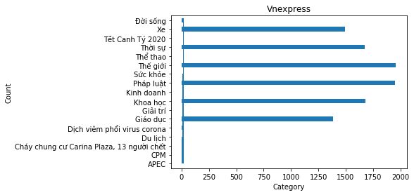

# Visualization Vnexpress

## Đọc dữ liệu vào bằng thư viện pandas
### Dữ liệu bao gồm các trường:
- Chủ đề
- Thời gian
- Tiêu đề
- Tóm tắt nội dung
- Nội dung chi tiết
- Các bài báo liên kết


```python
from matplotlib import pyplot as plt
```


```python
import pandas as pd

columns = ['category','date_time','title','summary','content','link']

vnexpress = pd.read_json('vnexpress.json',columns)

```

### Đọc file "vnexpress.json" được thu thập bằng Scrapy từ trước.

### Dữ liệu gồm 10470 bản ghi.


```python
vnexpress

```


<div>
<style scoped>
    .dataframe tbody tr th:only-of-type {
        vertical-align: middle;
    }

    .dataframe tbody tr th {
        vertical-align: top;
    }

    .dataframe thead th {
        text-align: right;
    }
</style>
<table border="1" class="dataframe">
  <thead>
    <tr style="text-align: right;">
      <th></th>
      <th>category</th>
      <th>date_time</th>
      <th>title</th>
      <th>author</th>
      <th>summary</th>
      <th>content</th>
      <th>link</th>
    </tr>
  </thead>
  <tbody>
    <tr>
      <td>0</td>
      <td>Thời sự</td>
      <td>Thứ sáu, 21/8/2020, 23:22 (GMT+7)</td>
      <td>9 bài học chống Covid-19</td>
      <td>None</td>
      <td>Bộ Y tế đang tổng kết kinh nghiệm từ Đà Nẵng, ...</td>
      <td>[Tại cuộc họp Thường trực Chính phủ về phòng c...</td>
      <td>[]</td>
    </tr>
    <tr>
      <td>1</td>
      <td>Thời sự</td>
      <td>Thứ ba, 18/8/2020, 12:40 (GMT+7)</td>
      <td>Bệnh nhân thứ 11 ở Hà Nội từng dự 7 cuộc liên ...</td>
      <td>Tất Định</td>
      <td>Sau khi có kết quả test nhanh âm tính, nữ bệnh...</td>
      <td>[Sáng 18/8, UBND quận Tây Hồ lập hai chốt cách...</td>
      <td>[Hà Nội thêm bệnh nhân Covid-19, \n, \n, \n, C...</td>
    </tr>
    <tr>
      <td>2</td>
      <td>Thời sự</td>
      <td>Thứ hai, 17/8/2020, 10:00 (GMT+7)</td>
      <td>Động đất 4,3 độ ở Sơn La</td>
      <td>None</td>
      <td>Trong hơn 20 phút sáng 17/8, huyện Mộc Châu, S...</td>
      <td>[Đang làm việc trong văn phòng tầng hai, ông T...</td>
      <td>[20 trận động đất trong một tuần ở Sơn La, \n,...</td>
    </tr>
    <tr>
      <td>3</td>
      <td>Thời sự</td>
      <td>Thứ tư, 19/8/2020, 23:14 (GMT+7)</td>
      <td>Đà Nẵng dỡ phong tỏa trung tâm y tế có ca nhiễ...</td>
      <td>None</td>
      <td>Trung tâm y tế quận Hải Châu, TP Đà Nẵng được ...</td>
      <td>[Từ ngày 20/8, trung tâm tiếp nhận bệnh nhân đ...</td>
      <td>[Đà Nẵng cách ly thêm một trung tâm y tế, \n, ...</td>
    </tr>
    <tr>
      <td>4</td>
      <td>Thời sự</td>
      <td>Thứ tư, 12/8/2020, 19:17 (GMT+7)</td>
      <td>Nhập cảnh trái phép, trốn cách ly</td>
      <td>Cửu Long</td>
      <td>Nguyễn Văn Tám, 25 tuổi, từ Campuchia vượt biê...</td>
      <td>[Tám bị Đồn Biên phòng cửa khẩu Quốc tế Dinh B...</td>
      <td>[Người đàn ông trốn khỏi khu cách ly, \n, \n, \n]</td>
    </tr>
    <tr>
      <td>...</td>
      <td>...</td>
      <td>...</td>
      <td>...</td>
      <td>...</td>
      <td>...</td>
      <td>...</td>
      <td>...</td>
    </tr>
    <tr>
      <td>10465</td>
      <td>Xe</td>
      <td>Thứ bảy, 17/11/2001, 14:22 (GMT+7)</td>
      <td>Xe dành cho nam giới của hãng Hyosung</td>
      <td>Dài/rộng/cao</td>
      <td>Cả hai chiếc xe đều có bề ngoài đồ sộ, bình xă...</td>
      <td>[\n, \n, \n, : 097/795/1.132 mm, : 132 kg, : 4...</td>
      <td>[]</td>
    </tr>
    <tr>
      <td>10466</td>
      <td>Xe</td>
      <td>Thứ ba, 9/1/2001, 14:10 (GMT+7)</td>
      <td>Tân trang xe máy</td>
      <td>None</td>
      <td>Vào dịp cuối năm, dịch vụ "đại tu" lại nhộn nh...</td>
      <td>[Sau khi làm đồng, xe được chuyển sang công đo...</td>
      <td>[]</td>
    </tr>
    <tr>
      <td>10467</td>
      <td>Xe</td>
      <td>Thứ sáu, 24/8/2001, 15:29 (GMT+7)</td>
      <td>So sánh giữa Yamaha Majessty và Suzuki Avenis</td>
      <td>None</td>
      <td>Majesty có thể được coi là chiếc xe scooter lớ...</td>
      <td>[Majesty liên tục xuống giá., Khác hẳn với nhữ...</td>
      <td>[]</td>
    </tr>
    <tr>
      <td>10468</td>
      <td>Xe</td>
      <td>Thứ hai, 5/2/2001, 14:46 (GMT+7)</td>
      <td>Trung Quốc: Không kiểm soát được nạn sản xuất ...</td>
      <td>None</td>
      <td>Đây là nước sản xuất xe máy nhiều nhất thế giớ...</td>
      <td>[]</td>
      <td>[]</td>
    </tr>
    <tr>
      <td>10469</td>
      <td>Xe</td>
      <td>Chủ nhật, 13/5/2001, 10:42 (GMT+7)</td>
      <td>Các "con nghiện" của xe HD</td>
      <td>None</td>
      <td>Không chỉ có các cao bồi hiện đại mới ưa xe Ha...</td>
      <td>[Bon Jovi ngả ngốn trên chiếc HD hai động cơ c...</td>
      <td>[]</td>
    </tr>
  </tbody>
</table>
<p>10470 rows × 7 columns</p>
</div>


```python
category = vnexpress.groupby('category')

```


```python
categoryCount = category['category'].count()
categoryCount.reset_index(name='count')
```


<div>
<style scoped>
    .dataframe tbody tr th:only-of-type {
        vertical-align: middle;
    }

    .dataframe tbody tr th {
        vertical-align: top;
    }

    .dataframe thead th {
        text-align: right;
    }
</style>
<table border="1" class="dataframe">
  <thead>
    <tr style="text-align: right;">
      <th></th>
      <th>category</th>
      <th>count</th>
    </tr>
  </thead>
  <tbody>
    <tr>
      <td>0</td>
      <td>APEC</td>
      <td>2</td>
    </tr>
    <tr>
      <td>1</td>
      <td>CPM</td>
      <td>3</td>
    </tr>
    <tr>
      <td>2</td>
      <td>Cháy chung cư Carina Plaza, 13 người chết</td>
      <td>1</td>
    </tr>
    <tr>
      <td>3</td>
      <td>Du lịch</td>
      <td>1</td>
    </tr>
    <tr>
      <td>4</td>
      <td>Dịch viêm phổi virus corona</td>
      <td>7</td>
    </tr>
    <tr>
      <td>5</td>
      <td>Giáo dục</td>
      <td>1386</td>
    </tr>
    <tr>
      <td>6</td>
      <td>Giải trí</td>
      <td>1</td>
    </tr>
    <tr>
      <td>7</td>
      <td>Khoa học</td>
      <td>1682</td>
    </tr>
    <tr>
      <td>8</td>
      <td>Kinh doanh</td>
      <td>1</td>
    </tr>
    <tr>
      <td>9</td>
      <td>Pháp luật</td>
      <td>1950</td>
    </tr>
    <tr>
      <td>10</td>
      <td>Sức khỏe</td>
      <td>1</td>
    </tr>
    <tr>
      <td>11</td>
      <td>Thế giới</td>
      <td>1959</td>
    </tr>
    <tr>
      <td>12</td>
      <td>Thể thao</td>
      <td>1</td>
    </tr>
    <tr>
      <td>13</td>
      <td>Thời sự</td>
      <td>1672</td>
    </tr>
    <tr>
      <td>14</td>
      <td>Tết Canh Tý 2020</td>
      <td>2</td>
    </tr>
    <tr>
      <td>15</td>
      <td>Xe</td>
      <td>1493</td>
    </tr>
    <tr>
      <td>16</td>
      <td>Đời sống</td>
      <td>17</td>
    </tr>
  </tbody>
</table>
</div>


###### Bảng thể hiện số lượng bài báo theo chủ đề (17 chủ đề)


```python

```


```python
fig, ax = plt.subplots()

data = vnexpress['category'].value_counts().sort_index().plot.barh()
x = range(17)
y = range(17)

ax.bar(x, y)
ax.set_title('Vnexpress')
ax.set_xlabel('Category')
ax.set_ylabel('Count')


```


    Text(0, 0.5, 'Count')





##### Biểu đồ thể hiện số lượng bài báo theo chủ đề, với chủ đề biểu diễn theo chiều ngang còn số lượng bài báo biểu diễn theo chiều dọc.

## Nhận xét

### Dữ liệu
- Dữ liệu được crawl bằng Scrapy, một số bài báo dưới dạng video, hình ảnh nên phần content sẽ không có nội dung,
- Một số trường trong các bản ghi có giá trị None.
- Dữ liệu được dùng trực tiếp sau khi crawl chưa qua quá trình làm sạch nên xuất hiện nhiều dữ liệu nhiễu.


### Biểu đồ
- Từ biểu đồ ta có thể thấy, chủ đề Thế giới có nhiều bài báo nhất.
- Đứng thứ hai là chủ đề Phát luật.
- Thứ ba, tư, năm, sáu lần lượt là Khoa học, Thời sự, Xe và Giáo dục.
- Cả sáu chủ đề này là chủ đề lớn, nên số lượng bài báo có phần vượt trội hơn so với các chủ đề khác.
- Các chủ đề còn lại là những chủ đề nhỏ, chủ yếu là nhưng chủ đề về thông tin hot trong thời điểm hiện tại như Dịch viêm phổi virus corona, Cháy chung cư,...

